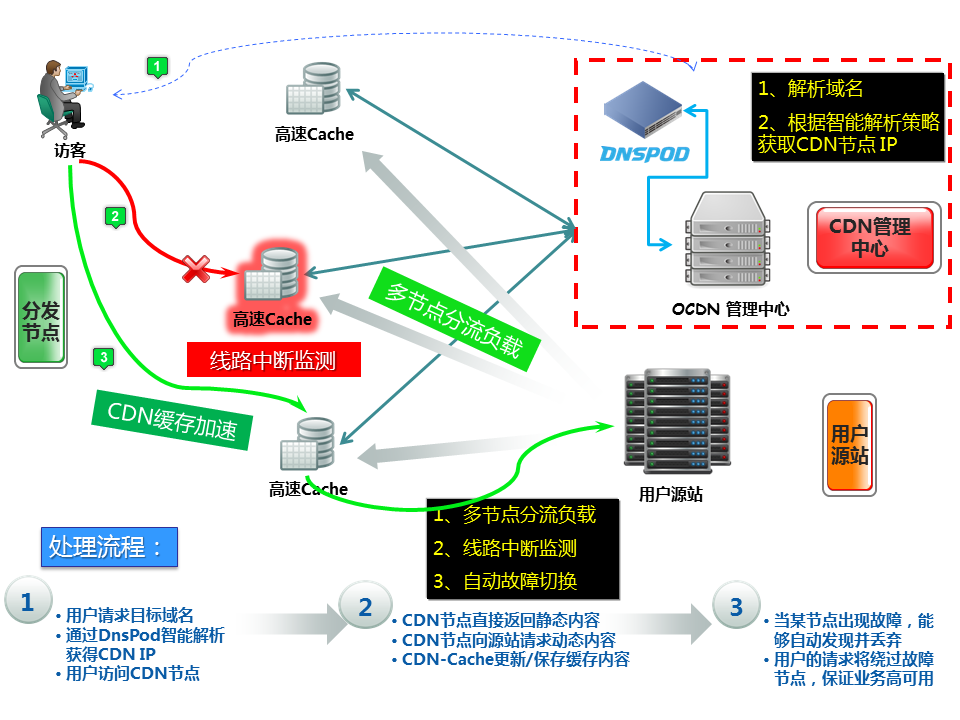

###OpenCDN

####功能特性

	OpenCDN是一套快速部署CDN加速的工具，针对专门提供CDN加速服务的企业或对多节点CDN加速有需求的企业，

	提供一套便捷的CDN加速管平台，可对每一个节点的状态、系统负载进行实时监测与统一管理，同时我们预制了多套常用缓存规则，

	支持多种复杂的CDN缓存场景。

架构图：

####CDN缓存加速，提升性能

	通过nginx缓存加速模块对网站性能优化，结合DnsPod综合采用多线路智能调度、故障监测、页面优化、页面缓存等技术，
	
	能够进一步提升网站访问速度，降低故障率，从而整体提升网站的用户体验。

####多节点智能分流，降低源站负载

	OpenCDN 和 DNSPod的智能解析做了联动，通过OpenCDN即可操作你在DNSPod的域名解析记录，并根据线路策略分配自建的CDN节点，
	
	将访客的流量按照其线路特性访问到最近的节点，这样加入OpenCDN的网站，CDN节点将承载大部分的访客流量。

####自动故障监测，打造高可用性

	OpenCDN 和 DNSPod的故障监控做了联动，OpenCDN部署好之后，当某个节点出现故障时，

	DNSPod的调度机制（D监控）能在3秒钟内将故障节点的流量牵引至当前可用节点，完全不影响访客的请求。

	即使源网站因故障导致中断，由于CDN节点对页面及静态资源均作了缓存，搜索引擎依旧能对静态页面进行爬行，
	
	同时也不影响用户的正常访问。

####集中管控，集中编制策略

	对于加入CDN管理平台的节点，将由管控中心对其运行状态、系统负载和网络数据流量进行实时监测，并统一管控节点的缓存策略.

	使所有CDN节点的配置保持同步，新的缓存规则配置通过一键触发即可使所有节点生效，使你具有轻松打造CDN集群的能力。

####CDN访问日志集中保存

	通过OpenCDN部署的节点默认已经将所有节点的访问日志通过Syslog-ng的方式实时传送到OpenCDN管理平台。管理平台将各个CDN节点
	
	上的日志进行汇总收集/分析，能够获取到所有用户详细的访问行为，同时对所有的非法访问行为进行均记录在案，以便于管理员
	
	进行日志分析与溯源。

